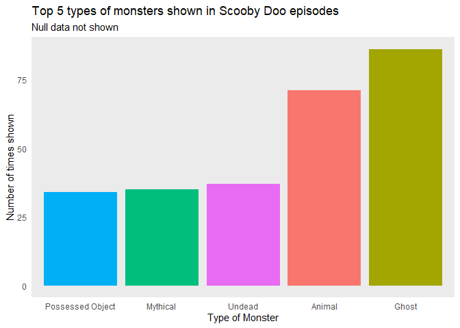
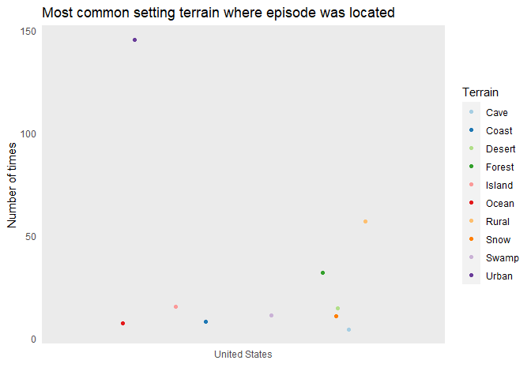

Scooby Doo
================

## Scooby Do, where are you?!

Even though I am already an adult, I do love cartoons! Scooby-Do was one
of favorites since I was a child. Every Saturday morning I would change
the channel from the news and I would sit on the couch to watch one more
episode while eating breakfast. Thanks to one of the Tidy Tuesday data
sets recommended by Dr. Sara Stoudt and the open source webpage Kable, I
was able to bring back some memories with pretty cool facts about this
tv show using R.

## Mistery solved

While going through the available data, I focus on figuring out the
following:

*The top 5 most common monsters shown on the episodes. *The most common
reasons behind the crimes done by the monsters/villains. *The most
common setting terrain for each episode. *Was the old Scooby-Do most
watched than the new seasons?

Let’s find out.

## *Scooby-Dooby-Doo!* *Don’t be scared!*

From the very first appearance of the mysterious monster at the
beggining of each episode, I was interested to see if there was a
pattern within the type of monsters this show presented. Of course, as
our dear Scooby always was scared of, Ghosts were the most popular
monsters throughout the series.

<!-- -->

## Get in, let’s solve the mistery. The Mistery machine awaits.

Known by almost any fan and non-fan of this tv show can recognize the
colorful van drove by the handsome and popular Greg, the leader of the
gang. This group of friends traveled mostly all around the world to
unmask the villains, yet for this plot, I decided to reduce the terrains
to those within the United States. So, to which terrain did our gang
traveled the most?

<!-- -->

There was nothing more exciting than the end of each episode, where the
gang explained what really happened and then asked the, most of the
times, unexpected villain to explain their reasons behind their
maleficent intentions. Turns out that Competition was the main motive…

<!-- -->

## Old Scooby vs New Scooby.

Seems that Scooby Do was a really great hit between 2005 and 2006.
Exactly the age at which I was five years old eating breakfast and
watching it from my living room couch.

    ## Warning: Removed 2 row(s) containing missing values (geom_path).

<!-- --> \`\`\` 
